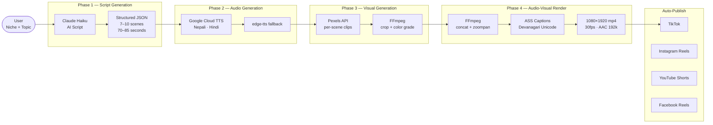
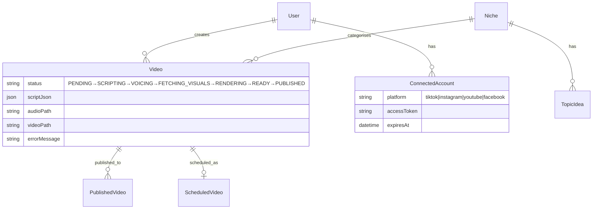

<div align="center">

# StoryForge

**One click. Niche → Script → Voice → Visuals → Published.**

Automated short-form video factory for Nepali and Hindi audiences.
Generates and publishes viral 60–90 second Reels to TikTok, Instagram, YouTube Shorts, and Facebook — with word-by-word Devanagari kinetic captions — for under $4/month.


</div>

---

## What Is This?

StoryForge is a team web app (2–5 users) that turns a niche and a topic into a fully produced, auto-published short-form video in minutes — entirely automated.

No editing software. No manual captions. No manual uploading. The entire production pipeline runs server-side on one click.

> Built for the Nepali and Hindi creator market — a highly underserved, high-engagement audience with virtually no AI-native tooling for their languages.

---

## Live Demo / Screenshots

### Home — Niche Grid

<!-- SCREENSHOT: Home page showing the 15 niche cards grid with stat row at top -->


### Generation Wizard

<!-- SCREENSHOT: Multi-step generation wizard — niche selected, topic being typed -->


### Script Viewer (Devanagari output)

<!-- SCREENSHOT: Script viewer showing the structured JSON output rendered as Nepali/Hindi scenes -->


### Video Queue

<!-- SCREENSHOT: Queue page showing videos with status badges: SCRIPTING / RENDERING / READY / PUBLISHED -->


### Video Detail + Publish

<!-- SCREENSHOT: Video detail page — player on left, platform toggles + caption editor on right -->


### Analytics Dashboard

<!-- SCREENSHOT: Analytics page — stat cards, views-per-day line chart, niche performance bar charts -->


---

## The Pipeline

One click triggers a 4-phase automated production pipeline:



### Phase-by-Phase Breakdown

| Phase | What Happens | Tech | Output |
|---|---|---|---|
| **1 · Script** | Claude Haiku receives a niche system prompt + topic. Returns structured JSON: title, hook, 7–10 scenes with narration + Pexels keywords + duration, full script text, CTA, hashtags | Anthropic SDK · Claude Haiku | `script.json` |
| **2 · Audio** | Full script text sent to Google Cloud TTS (Nepali `ne-NP` or Hindi `hi-IN` voice). edge-tts kicks in automatically if Google fails | Google Cloud TTS · edge-tts (Python) | `.mp3` voiceover |
| **3 · Visuals** | Each scene's `visual_keyword` + niche mood modifier → Pexels portrait video search → download SD clip → FFmpeg crop to 1080×1920 + niche color grade | Pexels API · FFmpeg (Python) | per-scene `.mp4` clips |
| **4 · Render** | Zoompan applied per clip → concat silent video → mix voiceover audio → burn ASS kinetic captions (word-by-word Devanagari, pop animation) → export | FFmpeg (Python) | final `1080×1920 .mp4` |

---

## Pipeline Screenshots

### Phase 1 — Script Generation

<!-- SCREENSHOT: Script generation in progress — Claude response rendering scene by scene -->


### Phase 2 — Audio Generation

<!-- SCREENSHOT: Voice panel showing Google TTS generating, waveform or status indicator -->


### Phase 3 — Visual Generation

<!-- SCREENSHOT: Visuals panel showing scene clips being fetched from Pexels, grid of thumbnails -->


### Phase 4 — Final Render

<!-- SCREENSHOT: Render panel — progress bar, final video player showing 9:16 output with captions -->


---

## The 15 Content Niches

Each niche is a complete content strategy: its own system prompt (stored in DB, tunable without code changes), visual mood, color grade, voice tone, Pexels keywords, and psychological trigger.

| Emoji | Niche | Language | Psychological Trigger | Caption Color |
|---|---|---|---|---|
| 👑 | Power & Control | NE + HI mix | Status & dominance detection |  Gold |
| 💕 | Love & Attraction | NE primary | Reproduction drive — strongest hook |  Pink |
| 💰 | Money & Wealth | HI primary | Financial survival anxiety |  Green |
| 🏛️ | Untold History | NE primary | Heritage pride + shock at hidden truth |  Amber |
| 🧠 | Dark Psychology | HI primary | Fear of manipulation + feeling smarter |  Purple |
| 🙏 | Culture & Identity | NE primary | "Who am I? Where do I come from?" |  Orange |
| ⚠️ | Fear & Danger | HI primary | Brain prioritises threat detection |  Red |
| 🔮 | Mystery & Conspiracy | HI primary | Information gap anxiety |  Indigo |
| ⚔️ | Corporate Wars | HI primary | Vicarious thrill of power battles |  Rose |
| 🌅 | Happiness & Meaning | NE primary | "Am I living correctly?" |  Yellow |
| 📉 | Economic Anxiety | NE primary | Financial survival + empowerment |  Emerald |
| 🚀 | Biography of Power | HI primary | Admiration + vicarious ambition |  Cream |
| 📚 | Hidden Knowledge | HI primary | Fear of missing critical information |  Lavender |
| 👥 | Social Psychology | HI primary | Social comparison — constant anxiety |  Pink-Red |
| 🏔️ | Stoicism & Wisdom | NE primary | Desire for meaning and mental strength |  Sage |

---

## Key Technical Achievements

### Devanagari Kinetic Captions
Word-by-word TikTok-style captions in Nepali/Hindi Unicode, burned directly into the video via FFmpeg ASS subtitle format. Each word pops in at 115% scale, settles to 100% in 80ms. Rendered with Noto Sans Devanagari Bold — the only font that correctly handles the script in FFmpeg.

<!-- SCREENSHOT: Close-up of Devanagari captions on a frame — showing pop animation, outline, color -->


### Per-Niche FFmpeg Color Grades
Every clip gets a niche-specific FFmpeg video filter: contrast curves, saturation shifts, vignettes. `power-control` is cold and shadowy. `love-attraction` is warm and golden. `mystery-conspiracy` is dark and desaturated with a heavy vignette. 15 distinct visual identities, zero manual editing.

### Anti-Ban Zoompan
Every scene clip gets a subtle slow zoom (z increases 0.0008 per frame, capped at 1.2×) applied before concat. This satisfies Facebook and YouTube's motion detection — videos without it get flagged as "static content slideshows" and suppressed.

### Smart Voice Fallback
Google Cloud TTS is the only provider with real Nepali (`ne-NP`) voice support. If it fails (quota, credentials, network), edge-tts (free, offline-capable Python library) takes over automatically with mapped neural voice equivalents — no intervention needed.

### System Prompts in the Database
Each niche's Claude system prompt lives in the `Niche` table, not in code. The team can tune prompts, test new angles, and update content strategy without a redeploy.

---

## Architecture

```
StoryForge/
├── frontend/                        # Next.js 16 app (standalone)
│   ├── src/
│   │   ├── app/                     # App Router pages + API routes
│   │   │   └── api/videos/
│   │   │       ├── script/          # POST → triggers Phase 1
│   │   │       └── [id]/
│   │   │           ├── voice/       # POST → triggers Phase 2
│   │   │           ├── visuals/     # POST → triggers Phase 3
│   │   │           └── render/      # POST → triggers Phase 4
│   │   ├── components/              # React UI components
│   │   └── lib/
│   │       └── pipeline/            # TypeScript pipeline orchestrators
│   │           ├── script-generation/    # calls Claude Haiku
│   │           ├── audio-generation/     # calls Google TTS / edge-tts
│   │           ├── visual-generation/    # calls Pexels → spawns Python
│   │           └── audio-visual-render/  # spawns Python render worker
│   └── prisma.config.ts
│
├── backend/
│   ├── pipeline/                    # Python workers (spawned by Next.js)
│   │   ├── audio-generation/        # voice.py + generate_voice.py
│   │   ├── visual-generation/       # visuals.py + fetch_visuals.py
│   │   └── audio-visual-render/     # render.py + render_video.py
│   └── prisma/                      # DB schema + seed data
│       ├── schema.prisma
│       └── seed.ts                  # seeds 15 niches with full prompts
│
├── .env.example
└── package.json                     # thin root: convenience scripts only
```

**Communication pattern:** Next.js API routes call Python workers via `child_process.spawn` — JSON in over stdin, JSON result back over stdout. No message queue needed at this scale.

---

## Data Model



---

## Cost Breakdown

Running at 2 videos/day (60/month):

| Service | Purpose | Monthly Cost |
|---|---|---|
| Claude Haiku | Script generation (AI) | ~$0.25 |
| Google Cloud TTS | Nepali/Hindi voiceover | ~$0.20 |
| Pexels Videos API | Stock footage per scene | **Free** |
| Replicate (Stable Diffusion) | Visual fallback only | ~$0.50 max |
| FFmpeg | Video rendering | **Free** (self-hosted) |
| PostgreSQL (Supabase free tier) | Database | **Free** |
| Cloudflare R2 | Video + audio storage | ~$1–2 |
| Meta Graph API | Facebook + Instagram publish | **Free** |
| TikTok Content Posting API | TikTok publish | **Free** |
| YouTube Data API v3 | YouTube Shorts publish | **Free** |
| **Total** | | **~$2–4 / month** |

---

## Tech Stack

| Layer | Technology |
|---|---|
| **Frontend** | Next.js 16, React 19, TypeScript 5, CSS Modules |
| **Auth** | NextAuth v5 (credentials provider) |
| **Database** | PostgreSQL via Prisma ORM 7 |
| **AI — Script** | Anthropic Claude Haiku (`@anthropic-ai/sdk`) |
| **AI — Voice** | Google Cloud TTS · edge-tts (Python fallback) |
| **Visuals** | Pexels Videos API · Replicate (fallback) |
| **Video Rendering** | FFmpeg (Python subprocess) |
| **Caption Format** | ASS subtitles — Noto Sans Devanagari Bold |
| **Python Workers** | Python 3.11, dotenv, requests, edge-tts |
| **Publishing APIs** | Meta Graph API, TikTok Content Posting API, YouTube Data API v3 |
| **Storage** | Cloudflare R2 (S3-compatible) |

---

## Getting Started

### Prerequisites

- Node.js 20+
- Python 3.11+
- PostgreSQL database
- Noto Devanagari font (`apt-get install fonts-noto-core fonts-noto-extra`)
- FFmpeg binary (included in `backend/bin/` — gitignored, download separately)

### 1. Clone and install

```bash
git clone https://github.com/AanandRimal/StoryForge.git
cd StoryForge

# Frontend dependencies (all node_modules live here)
cd frontend && npm install
```

### 2. Environment variables

```bash
cp .env.example frontend/.env
# Fill in all values — see .env.example for the full list
```

Key variables:

```env
DATABASE_URL=postgresql://...
ANTHROPIC_API_KEY=sk-ant-...
GOOGLE_APPLICATION_CREDENTIALS=/path/to/service-account.json
PEXELS_API_KEY=...
NEXTAUTH_SECRET=...

# Python worker paths
WORKER_PYTHON=/path/to/backend/pipeline/venv/bin/python
WORKER_SCRIPT=/path/to/backend/pipeline/audio-generation/generate_voice.py
WORKER_VISUAL_SCRIPT=/path/to/backend/pipeline/visual-generation/fetch_visuals.py
WORKER_RENDER_SCRIPT=/path/to/backend/pipeline/audio-visual-render/render_video.py

# Output paths
VIDEO_OUTPUT_DIR=/abs/path/to/frontend/public/outputs
```

### 3. Python worker setup

```bash
cd backend
python -m venv pipeline/venv
source pipeline/venv/bin/activate
pip install -r requirements.txt
```

### 4. Database setup

```bash
# From frontend/
npm run db:migrate   # run migrations
npm run db:seed      # seeds all 15 niches with system prompts
```

### 5. Run

```bash
# From project root
npm run dev
# or from frontend/
npm run dev
```

Open [http://localhost:3000](http://localhost:3000)

---

## Publishing Setup

Connect social accounts from the **Connections** page after first login. Each platform requires OAuth tokens stored in `.env`:

| Platform | Auth Type | Token Lifetime |
|---|---|---|
| Facebook Reels | Page Access Token | Long-lived (60 days) |
| Instagram Reels | Instagram Graph API | Long-lived (60 days) |
| TikTok | Content Posting API OAuth | 24h + refresh token |
| YouTube Shorts | OAuth 2.0 + refresh token | Indefinite (with refresh) |

> The Connections page shows expiry warnings 3 days before a token expires to prevent silent publish failures.

---

## The 5-Part Script Structure

Every generated video follows a proven psychological arc regardless of niche or language:

```
[0–5s]   Hook              → Shocking claim or open question. Never answers itself.
[5–15s]  Tension Escalation → Stakes raised. "What happens if you don't know this?"
[15–45s] The Revelation    → 2–3 specific facts. Real names. Real places. Real numbers.
[45–70s] Meaning Shift     → Why does this change how they see the world?
[70–80s] CTA Closer        → Follow / Save / Share
```

Max 10 words per sentence. Always active voice. Scripts are written to be spoken — not read.

---

## License

MIT
